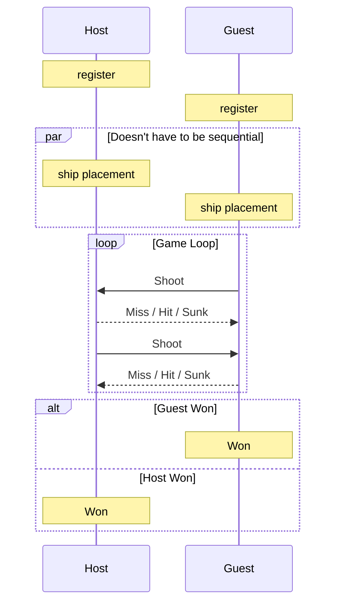

# IoT Battleship

An Embedded Software Battleship game.

## Architecture

This project runs on some modular independent boards and a MQTT Broker / Game Manager.

### The Board

#### Hardware

A single board is composed of:

- ESP32-WROOM-32 development board
- Adafruit NeoPixel 8x8 RGB Led Matrix
- Analog Joystick
- Development breadboard
- Jumper wires

#### Software

Each board is programmed using Arduino IDE and the Arduino programming language utilizing various libraries to simplify
the LED matrix usage, the WIFI/MQTT communication and json serialization/deserialization.

### The MQTT Broker / Game Manager

#### Hardware

Literally just a Raspberry Pi 5 (8GB Model).

#### Software

The MQTT Broker we used is mosquitto and the Game Manager was built on Rust using `rumqttc` for MQTT communication, serde
for serialization/deserialization and tokio for parallelization.

## Project layout

The project is divided into two repositories: one for the code that is run on the ESP32 boards and one run on the 
Raspberry Pi MQTT Broker / Game Manager.

### ESP32 Repository


### Raspberry Pi Repository


## How to run the Project

### ESP32 

Clone the repository, open it in Arduino IDE, include the needed libraries, connect the ESP32 board, select the board 
in the IDE, compile the code and burn it by pressing the BOOT button on the ESP32 

### Raspberry Pi

Ensure you have the following installed:
- [Rust toolchain](https://rustup.rs/) (edition 2024)
- An MQTT broker (e.g., `mosquitto`) running locally on port `1883`
- `tmux` (required by the Systemd configuration script)

### Running Locally

To build and run the daemon in development mode:

```bash
# Build the project
cargo build

# Run the Battleship daemon
cargo run
```

## ⚙️ Systemd Service Configuration

A systemd service file [battleship.service](./battleship.service) is provided to deploy the daemon in a tmux session
on startup.

### Installation

1. Copy the service file to the systemd user configuration directory:
   ```bash
   sudo cp battleship.service /etc/systemd/system/battleship.service
   ```
2. Reload the systemd daemon:
   ```bash
   sudo systemctl daemon-reload
   ```
3. Enable and start the service:
   ```bash
   sudo systemctl enable battleship.service
   sudo systemctl start battleship.service
   ```

### Managing the Service

- **Check Service Status**:
  ```bash
  sudo systemctl status battleship.service
  ```
- **Attach to the live stdout log session**:
  ```bash
  tmux attach -t battleship
  ```
- **Stop the Daemon**:
  ```bash
  sudo systemctl stop battleship.service
  ```

## User Guide

Once the Raspberry Pi is running the Game Manager and the ESP32 boards correctly connect to the Raspberry Pi hotspot,
the game is ready to start:



## References

[**Presentation**](https://docs.google.com/presentation/d/1vgT72Y98m0-YmwCWU1lp5Xn9kgrrET08/edit?usp=sharing&ouid=107977755165926991142&rtpof=true&sd=true)

[**Video Pitch**](https://youtu.be/fi8UGSru58Q)
