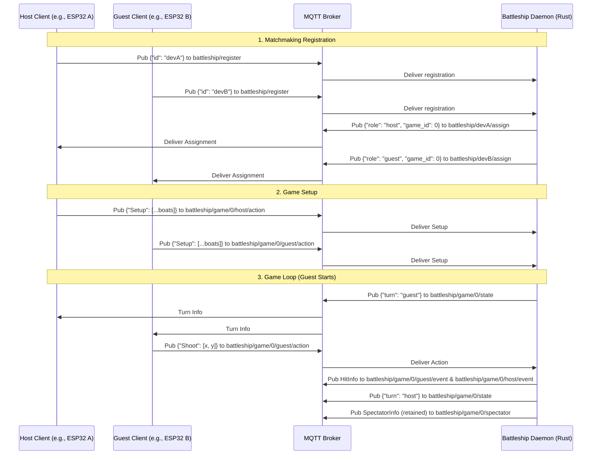

# 🚢 Embedded MQTT Battleship Backend

An asynchronous, lightweight Battleship game state engine and matchmaking daemon written in Rust. It coordinates game sessions between two players (e.g., embedded devices like ESP32 microcontrollers) communicating over an MQTT broker.

The engine handles matchmaking, game state orchestration, turn management, and real-time game status updates for spectators.

---

## 🏗️ System Architecture

The following diagram illustrates the matchmaking registration, game setup, and typical game-loop flow coordinated by the backend:



---

## 📂 Project Structure

- **[Cargo.toml](file:///home/daw/Desktop/uni/embedded/battleship/Cargo.toml)**: Defines dependencies, compilation configurations (using the Rust 2024 edition), and project metadata.
- **[battleship.service](file:///home/daw/Desktop/uni/embedded/battleship/battleship.service)**: Systemd service configuration for running the daemon automatically on startup inside a `tmux` session.
- **[src/main.rs](file:///home/daw/Desktop/uni/embedded/battleship/src/main.rs)**: Project entry point. Initializes MQTT connections, clears stale retained messages, subscribes to control topics, and initiates the async event loop.
- **[src/game/](file:///home/daw/Desktop/uni/embedded/battleship/src/game)**: Core battleship rules and game state logic.
  - **[mod.rs](file:///home/daw/Desktop/uni/embedded/battleship/src/game/mod.rs)**: Implements [Game](file:///home/daw/Desktop/uni/embedded/battleship/src/game/mod.rs#L56) orchestration, role/turn validation, and victory condition tracking.
  - **[board.rs](file:///home/daw/Desktop/uni/embedded/battleship/src/game/board.rs)**: Implements [Board](file:///home/daw/Desktop/uni/embedded/battleship/src/game/board.rs#L12) which manages hits tracking and maps spatial coordinates to boat references.
  - **[boat.rs](file:///home/daw/Desktop/uni/embedded/battleship/src/game/boat.rs)**: Implements [Boat](file:///home/daw/Desktop/uni/embedded/battleship/src/game/boat.rs#L14) structure, layout directions (`North`, `East`, `South`, `West`), and health/sunk detection.
  - **[grid.rs](file:///home/daw/Desktop/uni/embedded/battleship/src/game/grid.rs)**: Implements [Grid](file:///home/daw/Desktop/uni/embedded/battleship/src/game/grid.rs#L5), a generic 2D grid matrix serializable as a sequence of rows.
  - **[hit_result.rs](file:///home/daw/Desktop/uni/embedded/battleship/src/game/hit_result.rs)**: Defines the [HitResult](file:///home/daw/Desktop/uni/embedded/battleship/src/game/hit_result.rs#L4) enum (`Water`, `Hit`, `Sunk`).
- **[src/mqtt/](file:///home/daw/Desktop/uni/embedded/battleship/src/mqtt)**: MQTT integration layer.
  - **[mod.rs](file:///home/daw/Desktop/uni/embedded/battleship/src/mqtt/mod.rs)**: Exposes MQTT modules.
  - **[engine.rs](file:///home/daw/Desktop/uni/embedded/battleship/src/mqtt/engine.rs)**: Implements the main asynchronous [Engine](file:///home/daw/Desktop/uni/embedded/battleship/src/mqtt/engine.rs#L333) and [EngineState](file:///home/daw/Desktop/uni/embedded/battleship/src/mqtt/engine.rs#L32). Manages game registration, actions, incoming packet processing, and graceful shutdown handling.
  - **[callbacks.rs](file:///home/daw/Desktop/uni/embedded/battleship/src/mqtt/callbacks.rs)**: Defers execution of MQTT actions (e.g. publishes) outside the mutable borrow boundaries of the server state.
- **[testing/](file:///home/daw/Desktop/uni/embedded/battleship/testing)**: Simulation and verification tests.
  - **[game.nu](file:///home/daw/Desktop/uni/embedded/battleship/testing/game.nu)**: A Nushell scripting scenario to simulate registering two dummy players, setting up boards, executing turns, and asserting a winner.

---

## 📡 MQTT Topic API Specification

The daemon interacts with clients using the following topic conventions:

| Topic | Publisher | Subscriber | Payload Format | Description |
| :--- | :--- | :--- | :--- | :--- |
| `battleship/register` | Client | Daemon | `{"id": "DEVICE_MAC_OR_ID"}` | Device requests matchmaking. |
| `battleship/{id}/assign` | Daemon | Client | `{"role": "host"\|"guest", "game_id": 0}` | Notifies client of assigned game ID and role. |
| `battleship/game/{game_id}/{role}/action` | Client | Daemon | Action JSON (*see below*) | Client submits Board Setup or Shoot coordinates. |
| `battleship/game/{game_id}/{role}/event` | Daemon | Client | `{"attacker": "role", "hit": HitResult, "position": [x,y]}` | Feedback response on shot result. |
| `battleship/game/{game_id}/state` | Daemon | Client | `{"turn": "host"\|"guest"}` OR `{"winner": "host"\|"guest"}` | Publishes next turn turn-indicator or game-over winner notification. |
| `battleship/game/{game_id}/spectator` | Daemon | Spectator | `{"host_hits": Grid, "guest_hits": Grid, "status": GameStatus}` | Retained topic broadcast showing hit/miss layouts for display dashboards. |

### Payload Schema Examples

#### 1. Setup Action (`battleship/game/{game_id}/{role}/action`)
```json
{
  "Setup": [
    {
      "starting_position": [1, 6],
      "direction": "South",
      "len": 2
    },
    {
      "starting_position": [3, 6],
      "direction": "East",
      "len": 3
    }
  ]
}
```

#### 2. Shoot Action (`battleship/game/{game_id}/{role}/action`)
```json
{
  "Shoot": [4, 7]
}
```

---

## 🛠️ Build and Execution

### Prerequisites

Ensure you have the following installed:
- [Rust toolchain](https://rustup.rs/) (edition 2024)
- An MQTT broker (e.g., `mosquitto`) running locally on port `1883`
- `tmux` (required by the Systemd configuration script)

### Running Locally

To build and run the daemon in development mode:

```bash
# Build the project
cargo build

# Run the Battleship daemon
cargo run
```

---

## ⚙️ Systemd Service Configuration

A systemd service file [battleship.service](file:///home/daw/Desktop/uni/embedded/battleship/battleship.service) is provided to deploy the daemon in a tmux session on startup.

### Installation

1. Copy the service file to the systemd user configuration directory:
   ```bash
   sudo cp battleship.service /etc/systemd/system/battleship.service
   ```
2. Reload the systemd daemon:
   ```bash
   sudo systemctl daemon-reload
   ```
3. Enable and start the service:
   ```bash
   sudo systemctl enable battleship.service
   sudo systemctl start battleship.service
   ```

### Managing the Service

- **Check Service Status**:
  ```bash
  sudo systemctl status battleship.service
  ```
- **Attach to the live stdout log session**:
  ```bash
  tmux attach -t battleship
  ```
- **Stop the Daemon**:
  ```bash
  sudo systemctl stop battleship.service
  ```

---

## 🧪 Simulation Testing

You can simulate a complete automated game session using the provided Nushell simulation script:

1. Ensure `mosquitto` clients are installed (`mosquitto_pub`, `mosquitto_sub`, `mosquitto_rr`).
2. Run the Nushell script:
   ```bash
   nu testing/game.nu localhost
   ```
   Add `--fast` to execute the game turns with no artificial delays:
   ```bash
   nu testing/game.nu localhost --fast
   ```
